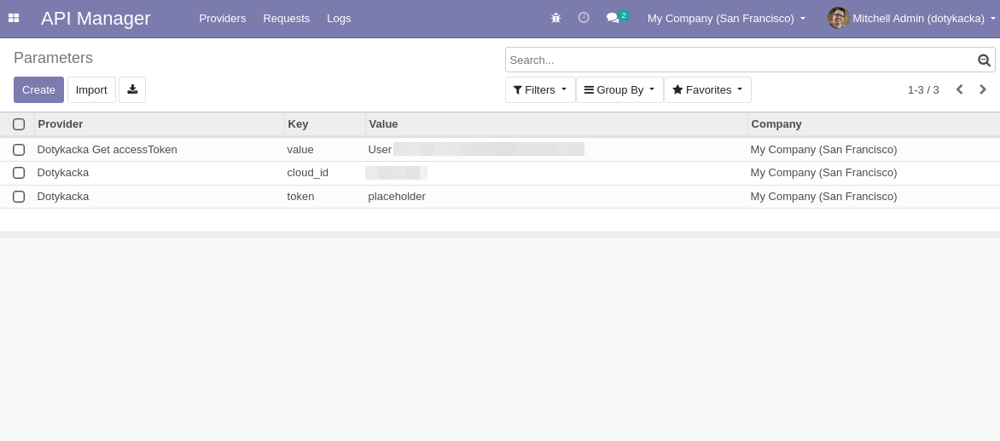
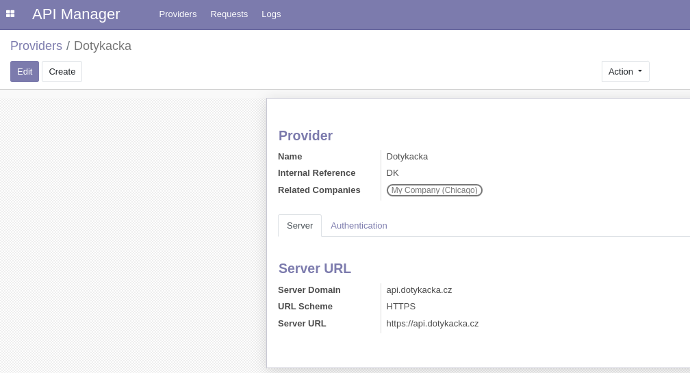
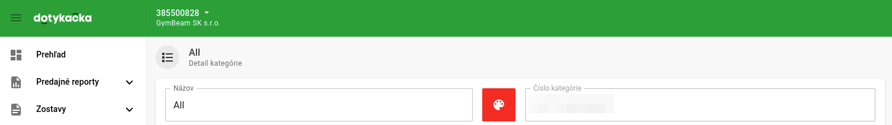
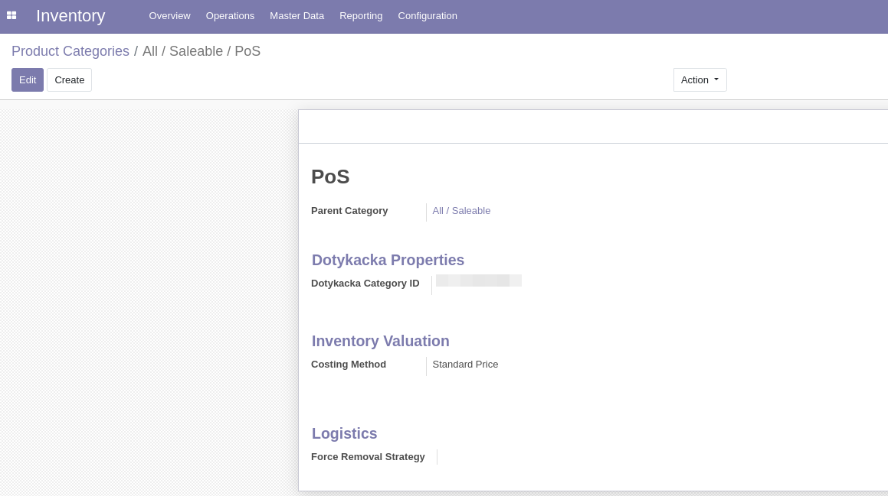
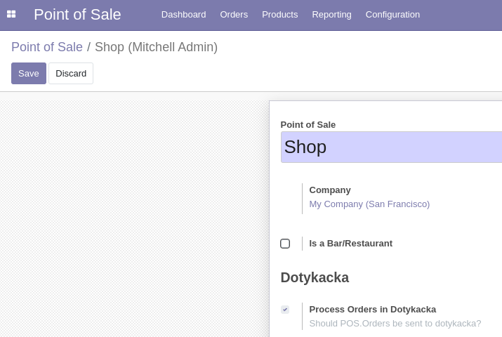
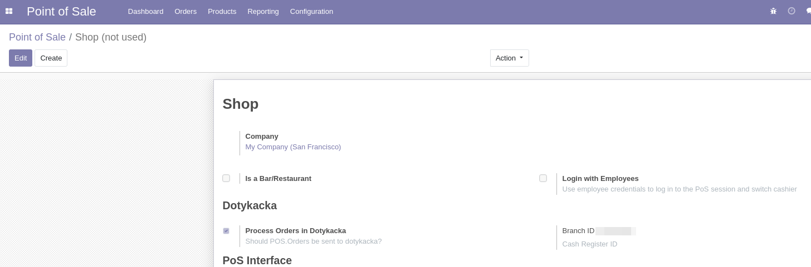
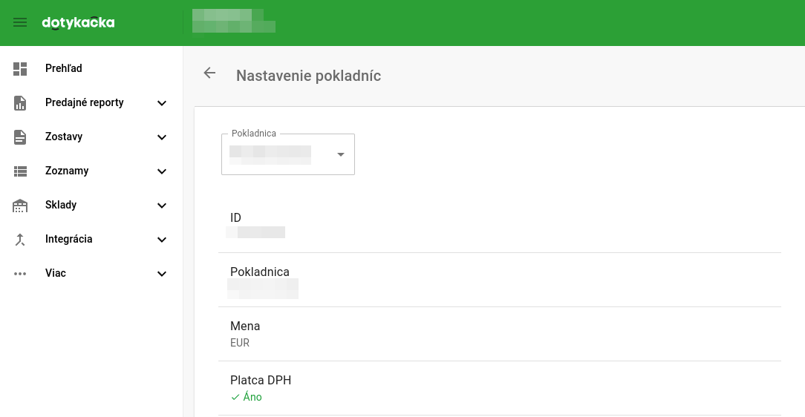
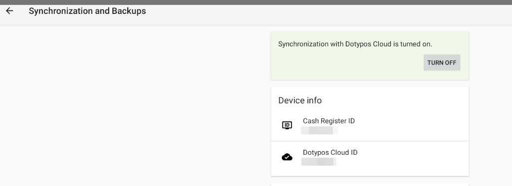
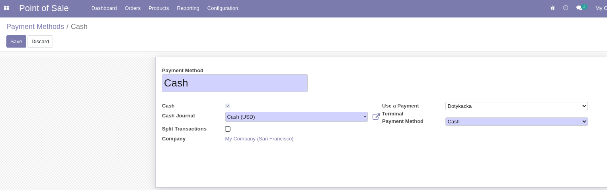
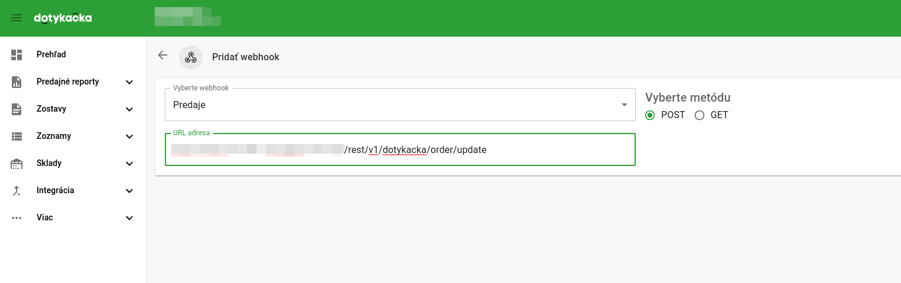

# Odoo & Dotykacka POS Integration Module

🎯 Description:

The '**_connector_dotykacka_**' module provides a seamless and efficient integration between Odoo and the Dotykacka Point of Sale (POS) system. This module enables businesses to manage their sales data in a unified and synchronized manner.

To use this addon it is necessary to have a valid subscription to the Dotykacka POS system. For more information, please visit the official website: [https://dotykacka.cz/](https://dotykacka.cz/)

🌟 Key Features:

Synchronize products between Odoo and Dotykacka POS.
Handle multi-POS configurations.
Multi-company support.
Asynchronous communication with Dotykacka API.
Support for returns and refunds.
Fiscalization is done on the Dotykacka side.

🖍 Limitations:

- issuing of receipts is done in odoo only
- refunds only in dotykacka

📦 Dependencies:

- Odoo Community or Enterprise Edition
- Dotykacka API Access (subscription required)

🙌 Contributing:

We welcome contributions, whether it's bug reports, feature requests, or pull requests! 
 Please feel free to submit issues and contribute to the project through the GitHub repository.

🔗 Links:

- Odoo v13 Community Edition: [https://www.odoo.com/page/community](https://www.odoo.com/page/community)
- Dotykacka POS: [https://www.dotykacka.cz/en/point-of-sale](https://dotykacka.cz/)

📨 Support:

For any questions, issues, or suggestions, please reach out to us through the GitHub issue tracker or leave message at daniel.lagin@gymbeam.com.

👨‍💻 Author:

- GymBeam Odoo Team
- contact email: daniel.lagin@gymbeam.com
- https://gymbeam.sk

🔐 License:

This module is licensed under the LGLv3 License. For more information, please refer to the LICENSE file in the repository.

❗ Disclaimer:

We are not affiliated with Dotykačka ČR s.r.o. company. This open-source addon is created solely for the purpose of integrating with the dotykacka API and is not officially endorsed or supported by Dotykačka ČR s.r.o. company.

The use of this Odoo PoS addon that connects to the dotykacka API is at the user's own risk. We are not responsible for any damages or liabilities that may arise from the use of this addon. The addon is provided as-is, without any warranty or guarantee of any kind, whether express or implied. Users of this addon should ensure that they are complying with any applicable laws, regulations, or requirements, and should use the addon responsibly and in accordance with best practices.

## 📚 Documentation:

| Name  | Url |
| ------------- | ------------- |
| API  | https://docs.api.dotypos.com |
| Documentation | https://manual.dotykacka.cz |
| Admin| https://admin.dotykacka.cz |
| Download .apk | https://marketplace.dotykacka.cz |
| Postman Collection | https://public-docs-data.s3-eu-west-1.amazonaws.com/api/postman/Dotypos+API+v2.postman_collection.json |

To test PoS integration, you need to have test instance of dotypos cloud and created a local environment. This consists of PoS software that needs to be installed on an Android device (either on a physical device (phone, tablet...) or using Android Studio).

Installation is described here - https://manual.dotykacka.cz/instalaceaplikaci.html

### Installation of odoo addon

With installation of '**_connector_dotykacka_**' addon, addon '**_api_manager_**' is installed as dependency. This addon is used for communication with Dotykacka API.

### Obtaining the Refresh Token:

- https://docs.api.dotypos.com/authorization

Hint: url is not displayed in URL bar, you need to enable developer tools, uncheck Preserve Logs and search for url with token.

### Obtaining the Access Token

A sample request is in the Postman Collections link mentioned above. In Postman you need to set the refreshToken and cloudId variables.

### Prerequisites

- VAT records configured as Included in Price
- Created Pricelist with already updated prices/taxes

### Hardware - Cash Register

In Tablet application, each Cash Register has to be configured for specific Cloud ID
- Hamburger Menu → Application Settings → Synchronization & Backups → Fill Cloud ID → Turn On Synchronization with Dotypos Cloud
- Cash Register ID  is equal to  Branch ID in Odoo

### Rest API

#### Key Value

For each company configure these Key Value records.

| Api Provider  | Key | Value | Company |
| ------------- | ------------- | ------------- | ------------- |
| Dotykacka Get Access Token | value | User HASH | Related Company | 
| Dotykacka | cloud_id  | Cloud ID | Related Company | 
| Dotykacka | token  | placeholder | Related Company | 

#### Provider

On provider Dotykacka assign Related Companies.

#### Inventory

Cloud dependent, must to be done for each Cloud
- Dotykacka → Item management → Categories

1. First create new category All
2. Delete already created categories - Ovocie, Pečivo
3. Copy Category ID of category All to Odoo

##### In Odoo
- Inventory → Configuration → Product Categories
- Select related product categories and change Dotykacka Category ID

#### POS

- POS Configuration: Point of Sale → Configuration → Point of Sale → select PoS to configure → Enable Dotykacka

##### Branch ID  - Cash Register ID

In Odoo each POS instance needs to be connected to specific Cash Register (HW). Fill Branch ID under Dotykacka.

How to find Branch ID?
- Login to https://admin.dotykacka.cz
- Select Company → Cloud settings (icon on the top right) → Register Settings →  Select Cash Register → ID.

- In Hardwave (Cash Register)
- Hamburger Menu → Application Settings → Synchronization and Backups → Cash Register ID

##### Payment method

Each payment method must have assigned ID in dotykacka based on this: https://docs.api.dotypos.com/api-reference/enums/payment-methods
Point of Sale →  Configuration →  Payment Methods → 
- set Use Payment Terminal  to Dotykacka for every method that will be processed through Dotykacka
- set Payment Method 

### Asynchronous communication

Odoo communicate dotykacka asynchronously. This means that Odoo does not wait for Dotykacka to confirm the receipt of the data. This is done to avoid delays in the POS. If the communication fails, the data is stored in the database and sent again later.
It is also used in returns/refunds - if cancel is done in dotykacka, it is automatically sent back to odoo and paired with/created relevant order.

For asynchronous communication db_name must be set, also parameter web.base.url must be the same as configured in dotykacka.

### Return/Claims

Creation of returns and claims are not supported by dotykacka API and has to be done manually in dotykacka. It is synchronized back to odoo using webhooks and new order is created in odoo.
